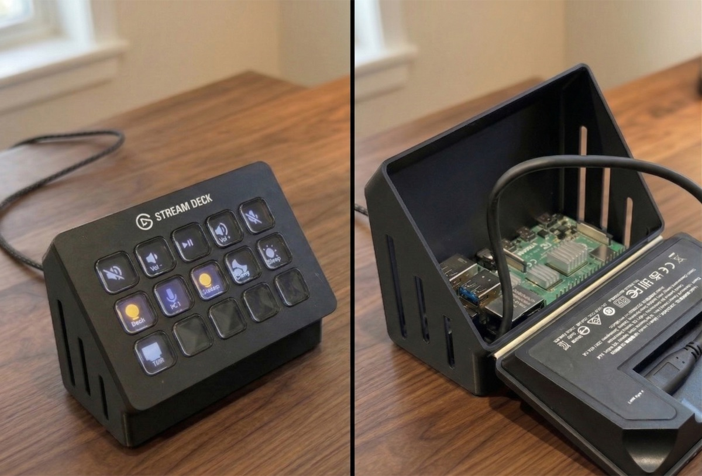

# OmniDeck Hardware

A 3D-printable case that houses a Raspberry Pi behind an Elgato Stream Deck, turning them into a single compact unit.

## What Is This?

This is the enclosure for [OmniDeck](https://github.com/wemcdonald/OmniDeck) — a system that turns a Raspberry Pi into the brain of your Stream Deck. The case mounts the Pi directly behind the deck so you have one tidy unit on your desk instead of two separate devices.

## Printing

- **Material**: PLA or PETG
- **Infill**: 15–20%
- **Supports**: Yes (minimal)
- **Layer height**: 0.2mm recommended

## Hardware

- **Heatset inserts**: M2.5, 4mm tall — press into the mounting holes with a soldering iron
- Raspberry Pi 4 or 5
- Elgato Stream Deck (MK.2 / V2)
- Short USB-C cable for Pi-to-deck connection

## Files

| File | Description |
|------|-------------|
| [`OmniDeck.3mf`](https://github.com/wemcdonald/OmniDeck-hardware/raw/master/OmniDeck.3mf) | Print-ready model (recommended) |
| [`OmniDeck.f3z`](https://github.com/wemcdonald/OmniDeck-hardware/raw/master/OmniDeck.f3z) | Fusion 360 source for modifications |

## License

MIT
